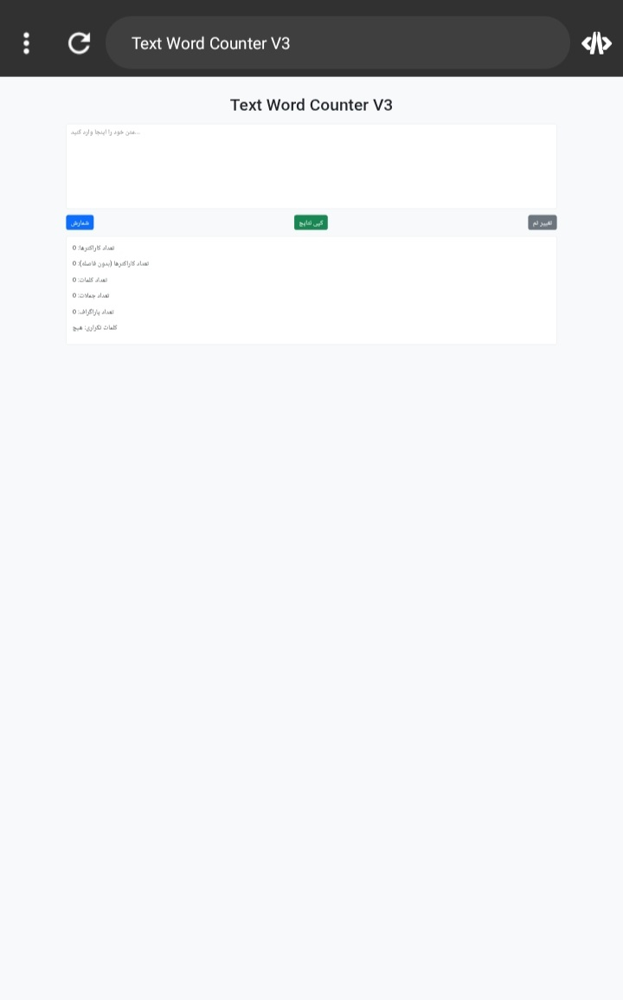

# Text Word Counter V3

Text Word Counter V3 is an advanced web application that allows users to:
- Count characters (with and without spaces)
- Count words, sentences, and paragraphs
- Detect duplicate words with their frequency
- Copy results to clipboard
- Switch between Light and Dark mode

Built using HTML, CSS, Bootstrap 5, and Vanilla JavaScript.

## Screenshots

## How to Use
1. Open `index.html` in your browser.
2. Enter or paste your text into the textarea.
3. Click **Count** to see results.
4. Click **Copy Results** to copy the statistics.
5. Click **Toggle Theme** to switch between Light and Dark modes.

## Technologies
- HTML5
- CSS3
- Bootstrap 5
- JavaScript (Vanilla)

## License
This project is open source and free to use.
